# 1.系统安装

## 1.1 安装前准备

* 在安装之前，应确认好解决方案的部署模型。
* 确认硬件和操作系统符合要求。
* 作为管理员登录到计算机。
* 在安装软件之前，将用户账户控制修改为“从不通知”。打开控制面板用→用户账户→用户账户→更改用户账户控制设置，将“选择何时通知您有关计算机更改的消息”的参数修改为“从不通知”。

## 1.2 安装数据库

数据库推荐SQL Server 2008及以上版本，或者PostgreSQL 10.11及以上版本。

### 1.2.1 SQL Server的安装

**SQL Server以2017为例，在安装组件中如下配置：**
 
**1. 点击安装包中的“SETUP.EXE”**，在弹出的安装中心窗口中选择“安装”→“全新SQL Server 独立安装或向现有安装添加功能”，之后在弹出的安装程序窗口中一直下一步（后续无说明的项操作都是下一步），直到安装类型这一步骤里，选择“执行SQL Server2017的全新安装”

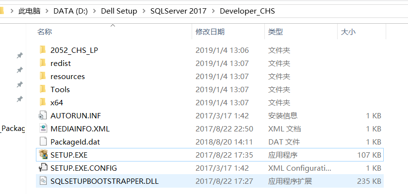
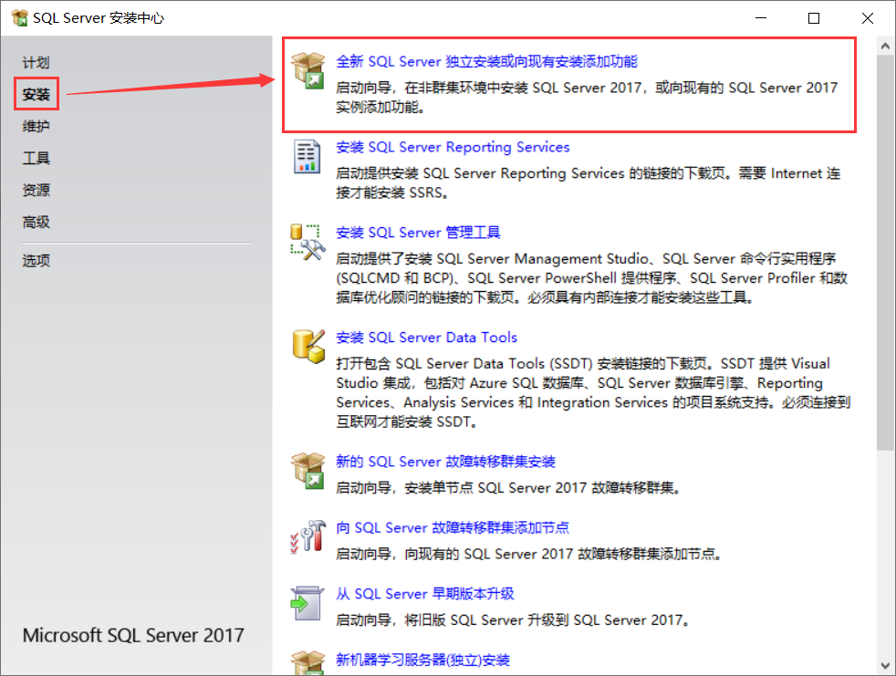

**2. 产品密钥**：指定版本为“Developer”勾选“输入产品密钥”，不用输入

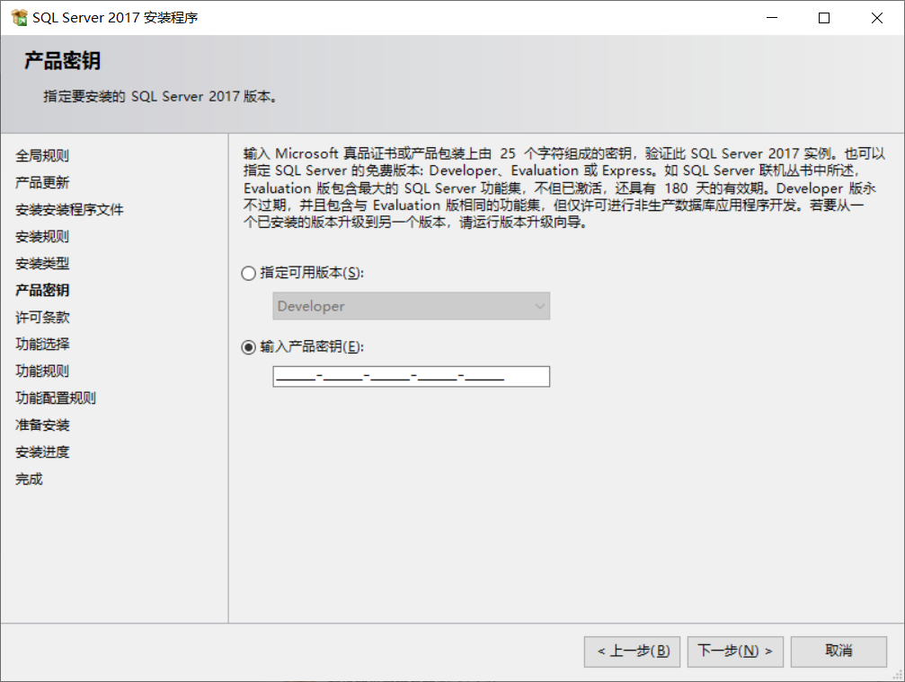

**3. 功能选择**：选择“数据库引擎服务”，实例根目录自行设置或默认

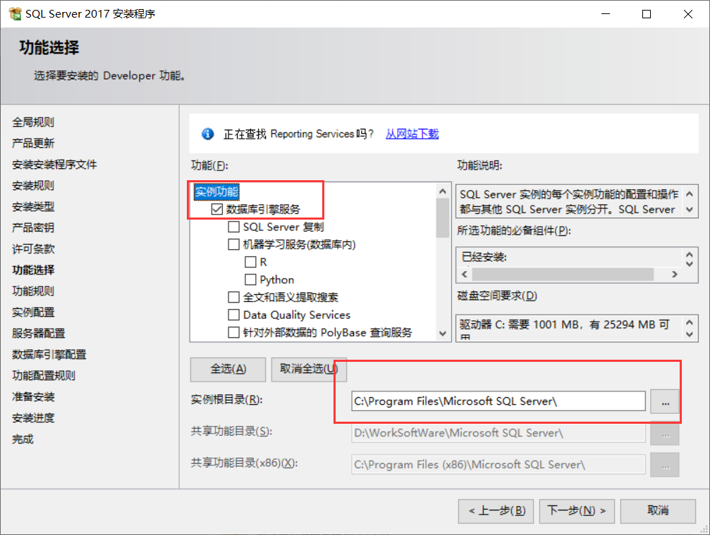

**4. 实例配置**：勾选“默认实例”

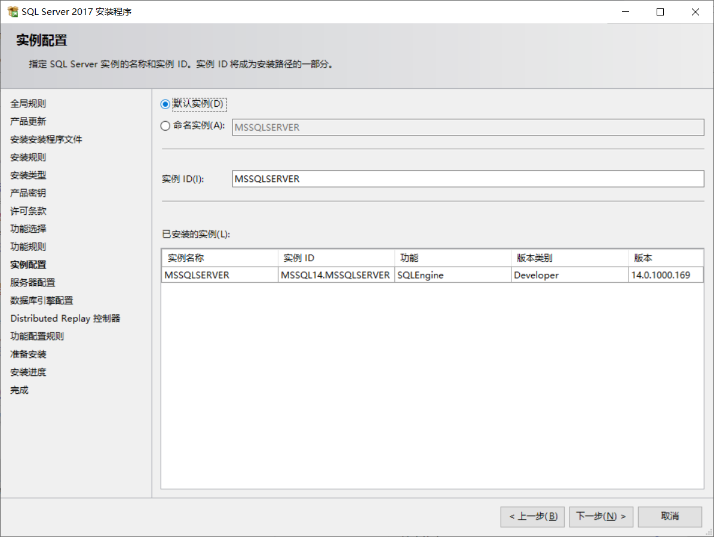

**5. 数据库引擎配置**：服务器配置下身份验证模式中勾选“混合模式”，密码自行设置，指定SQL Server管理员，点击“添加当前用户”，之后在数据目录中自行设置好各项目录

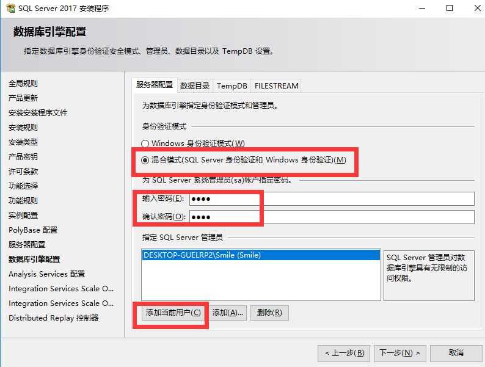

**6. 安装完成之后**，如果需要可在官网下载SSMS的安装包，不需要则忽略此步，点击安装即可。

### 1.2.2 PostgresSQL的安装

#### 1.2.2.1 下载PGSQL

* 官网地址：https://www.postgresql.org/
* 官方介绍文档：https://www.postgresql.org/about/
* 下载地址：https://www.postgresql.org/download/

在下载地址中选择Windows进入下载页面，如图，点击后进入选择适用系统页面，选择后即可下载

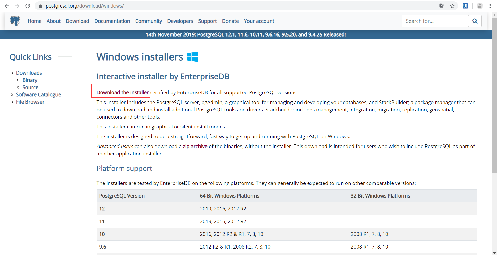

#### 1.2.2.2 安装PGSQL

**点击下载完的安装文件，开始安装。安装过程很简单，一直下一步就行，其中有一步是设置密码（作用等同于SQLSever的SA密码）**

**安装完成之后的界面**

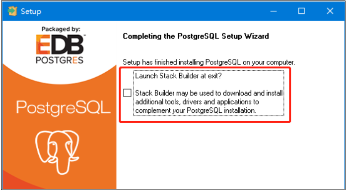

**这里选中了复选框，再点击完成后会立即运行Stack Builder**

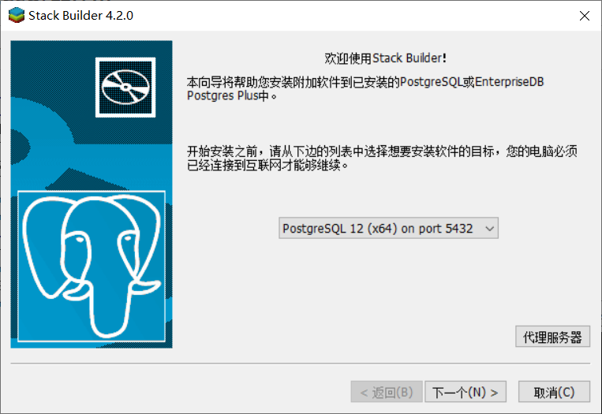

**后面可以根据需求选择性安装,下一步直到结束即可**

## 1.3 安装. Net Framework 4.6

首先安装Microsoft. Net Framework 4.6 Setup.exe，.NET Framework 4.6 中文包 Setup.exe是中文补丁，请在其后安装。

如果系统中已经安装了4.6及以上，在安装时会提醒已安装，就不需要再安装，Win10系统自带 .NET Framework 4.7，在系统的“启用或关闭Windows功能”中看到。

## 1.4 安装和配置Internet信息服务（IIS）

im企业运营中心运行需要使用IIS服务，请如下配置（以windows10专业版系统为例）：

* 开控制面板\程序\程序和功能

* 单击进入“启用或关闭windows功能”

* 勾选Internet信息服务，勾选万维网服务下应用程序开发功能中的asp配置，确定。

## 1.5 安装MongoDB

imgenius系统使用MongoDB来承担文件服务器和内容服务器的组件角色， MongoDB是一个基于分布式文件存储的数据库。以4.0版本为例，安装如下：

* 运行“mongodb-win32-x86_64-2008plus-ssl-4.0.8-signed.msi”安装MongoDB。（注：如果自行选择了安装路径，请确保安装路径无中文字符）

* Data（数据存盘路径）文件夹和log（日志存盘路径）文件夹会在安装时按照自己配置自动创建。

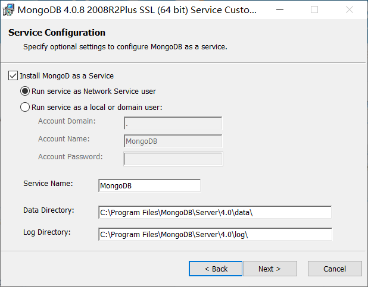

### 1.5.1 安装完成后的步骤

1)首先创建用户管理员和系统管理员管理员身份运行“cmd.exe”。

2)切换到安装路径的“Server\4.0\bin”下。（如：“C:\Program Files\MongoDB\Server\4.0\bin”）

3)运行“mongo”进入shell。

4)运行“use admin”到admin数据库下。

5)运行
“db.createUser({user:"userAdmin",pwd:"请自行设置",roles:[{role:"userAdminAnyDatabase",db:"admin"}]})”创建用户管理员（注：请自行设置user和pwd，并记住；用户名和密码不要含有“@”符号）

6)按“Ctrl + C”退出。

7)运行“mongo.exe --port 27017 -u "userAdmin" -p "请自行设置" --authenticationDatabase "admin"（注：端口与bin文件夹下mongod.cfg内容一致、用户名和密码与自行修改保存一致

9)运行“use admin”。	

10)运行
“db.createUser({user:"admin",pwd:"请自行设置",roles:[{role:"dbAdminAnyDatabase",db:"admin"},{role:"readWriteAnyDatabase",db:"admin"}]})”创建系统管理员（注：请自行设置user和pwd，并记住；用户名和密码不要含有“@”符号）

11)查看用户
使用db.system.users.find()命令就可以查看我们刚刚创建的用户了。

### 1.5.2 启用权限认证

**注：非生产环境可忽略此步。**

1. Mongo安装完成后，是默认未开启权限认证的，所以我们不创建用户，也可以登录和使用，在robomongo中测试时，“Database”，“UserName”和“Password”为空时，点击“Test”测试也会链接成功。在生产环境中，mongodb未开启权限认证会导致数据被窃取。和其它数据库一样，权限的管理都差不多一样。

2. 但不同的是mongodb的用户是跟数据库相关联的，具体的数据库，还是需要有对应的用户，也就是说哪怕是超级管理员也不能操作其他数据库的。

3. mongodb存储所有的用户信息在admin 数据库的集合system.users中，保存用户名、密码和数据库信息。
    
4. 由于mongodb默认不启用授权认证，只要能连接到该服务器，就可连接到mongod。若要启用安全认证，需要更改配置文件参数--auth。

**设置权限的步骤如下：**

1)新打开一个cmd，输入net stop MongoDB，停止服务。

2)打开安装路径bin目录下的“mongod.cfg”文件，将#security:的注释去掉，然后添加authorization: enabled #注意authorization前面要有两个空格，如图：

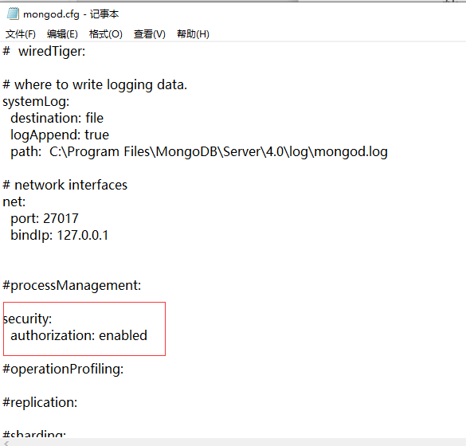

3)回到cmd，输入net start MongoDB，启动服务

4)这时候就需要输入db.auth('admin','admin+iDong')启用auth认证，如图：

会看到返回的值为1，这就表示启动成功了。

5)按“Ctrl + C”退出。

### 1.5.3 测试连接和查看是否安装成功

* 使用“robomongo”测试连接，在创建连接时，在“Authentication”Tab页，选中“Perform authentication”，“Database”输入“admin”,“UserName”和“Password”使用系统管理员的，“Author Mechanism”选择“SCRAM-SHA-1”。点击“Test”按钮进行测试。

* 在imSMC中设置MongoDB的IP、端口、用户名和密码。（注：此处的用户名和密码使用系统管理员的）

* 查看服务是否启动，如图即安装成功：

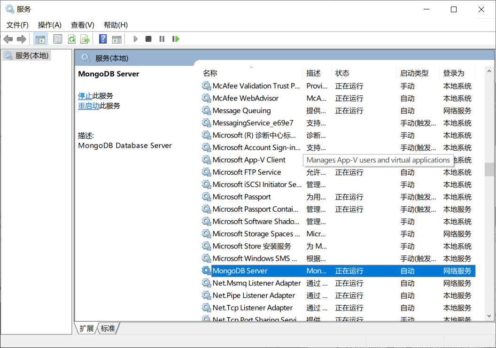

## 1.6 安装RabbitMQ

### 1.6.1 安装Erlang环境

运行“otp_win64_21.3.exe”安装Erlang环境。（注：如果自行选择了安装路径，请确保安装路径无中文字符，如果已经安装忽略此步）

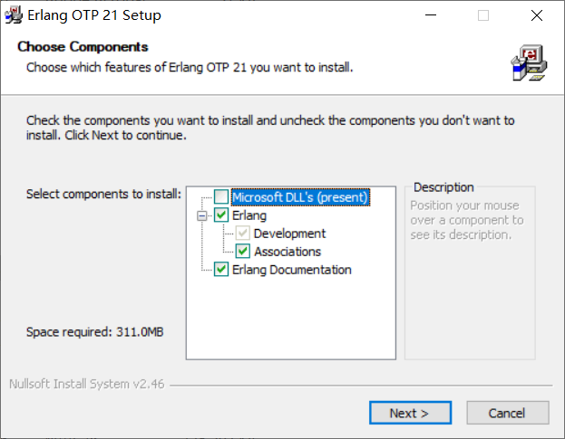

### 1.6.2 安装RabbitMQ

运行“rabbitmq-server-3.7.14.exe”安装RabbitMQ。（注：如果自行选择了安装路径，请确保安装路径无中文字符，如果已经安装忽略此步，已经安装的会有如下图的提示，点击确定继续）

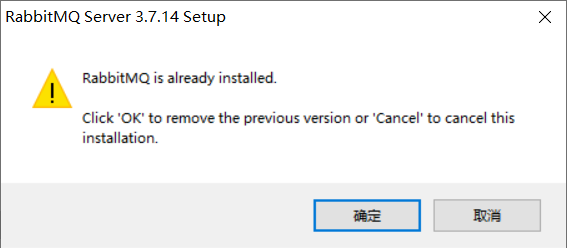
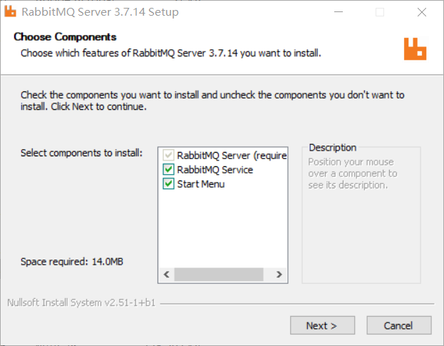

### 1.6.3 设置RabbitMQ

**（如果已经设置忽略此步）**

**1. 修改缺省用户guest的密码**，在cmd中运行下面语句
	
"C:\Program Files\RabbitMQ Server\rabbitmq_server-3.6.10\sbin\rabbitmqctl" change_password guest 密码,自行设置
	
**2. 创建用户**，在cmd中分别运行以下命令
	
"C:\Program Files\RabbitMQ Server\rabbitmq_server-3.6.10\sbin\rabbitmqctl" add_user admin 密码,自行设置
	
"C:\Program Files\RabbitMQ Server\rabbitmq_server-3.6.10\sbin\rabbitmqctl" set_user_tags admin administrator
	
"C:\Program Files\RabbitMQ Server\rabbitmq_server-3.6.10\sbin\rabbitmqctl" set_permissions -p / admin ".*" ".*" ".*"
	
**3. 启用Web管理插件**，在cmd中运行下面语句：
	
"C:\Program Files\RabbitMQ Server\rabbitmq_server-3.6.10\sbin\rabbitmq-plugins" enable rabbitmq_management
	
注：其中“C:\Program Files\RabbitMQ Server”为RabbitMQ安装路径，如果安装时已修改，请改成修改后的；“密码,自行设置”为密码，用户可以设置成自己的密码。

**4. 验证RabbitMQ**，在IE中输入网址 “http://localhost:15672”， 在UserName和Password分别输入admin和(密码,自行设置)，如果登录成功，表示安装成功。（如果已经验证忽略此步）

**5. 打开SMC（im系统管理中心）**，把访问RabbitMQ的信息写入到“系统设置”→“服务”→“内部消息”，勾选上“启用”，在“RabbitMQ服务器内网IP”中填写RabbitMQServer所在机器的IP地址；在“RbbitMQ用户名”和“RabbitMQ密码”中填写创建的用户和密码；在“WebSocket服务器外网IP”中填写同步服务器所在机器的外网IP地址，“WebSocket服务器外网端口”填写‘6018’，“WebSocket服务器外网端口（SSL）”填写‘9090’

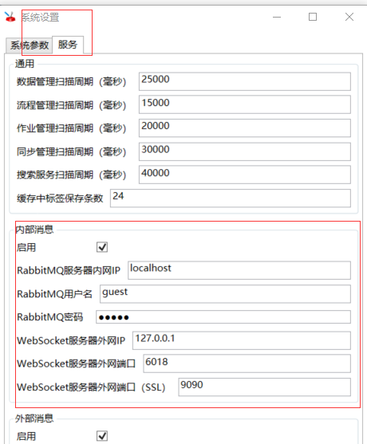

## 1.7 安装imgenius

**1. 下载imgenius安装盘**，解压安装盘中的 imgeniusV3.x.x.iso 文件，然后双击运行setup.exe

* 在欢迎使用安装向导对话框中，单击下一步。

* 在许可协议对话框中选择同意，单击下一步。

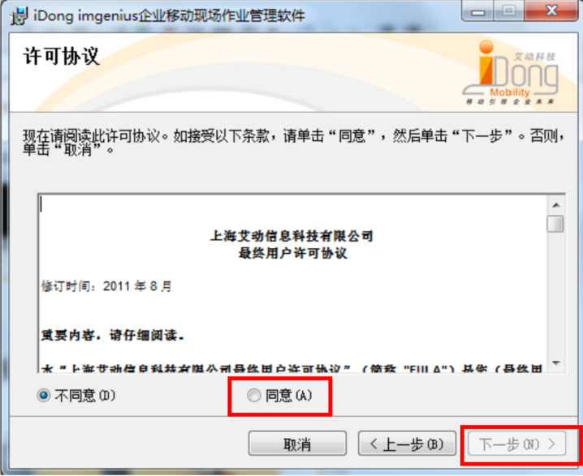

* 在选择安装文件夹对话框中，执行以下任何操作，然后单击下一步。

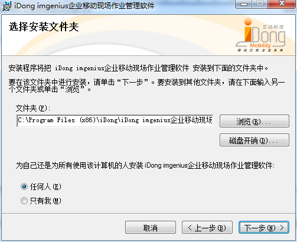

* 选择浏览可以更改应用安装路径

* 选择磁盘开销可以查看目前磁盘的可用容量

* 选择任何人允许所有登录此计算机的用户都能使用该应用

* 选择只有我只允许安装者使用该应用

* 安装对话框中，允许单击上一步以确认前面的选项。如果确认，单击下一步。

* imgenius企业移动现场作业管理软件开始安装。安装大约需要几分钟的时间。

* 安装完成对话框出现后，imgenius企业移动现场作业管理软件成功安装。单击关闭。

* 安装完毕后，在开始菜单→程序，可以看到iDong→imgenius企业移动现场作业管理软件以及相应的组件。

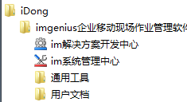

**注意：在安装期间的任何时候可以**：

* 单击上一步回到前面的步骤，以做选择的修改。
* 单击取消中止安装，此时会弹出一个对话框，显示安装回滚的过程或者中止安装。

## 1.8 部署im企业运营中心

**1. 安装好imgenius以后**，在希望部署im企业运营中心的站点运行部署工具，以部署im企业运在im企业运营中心，打开开始菜单→程序→ iDong→imgenius企业移动现场作业管理软件→通用工具→im部署工具。

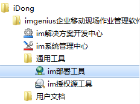

**2. im部署工具将部署im企业运营中心站点**。在部署之前，请用户自行配置好IIS和相应网站，当然可以使用缺省网站。运营中心支持解决方案的运行。

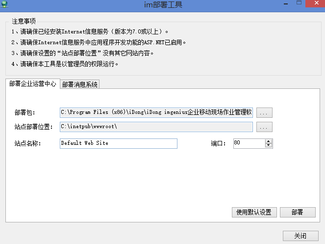

* 站点部署位置： 指定网站虚拟目录。
* 站点名称：设定站点名称。 
* 端口：设定网站端口。 

**3.配置完成后，点击部署**。因为im企业运营中心使用了 ASP.Net MVC，部署工具将检查你是否安装了 ASP.Net MVC。如果没有安装，将直接安装。

* 如果部署工具检测到你已经安装，会弹出对话框提示是否重新安装。
点击是，部署工具将启动 ASP.Net MVC安装包。

* 点击Next，将进行安装。

* 点击确定，回到部署工具窗口，点击关闭，退出应用。

* 点击Finish，MVC安装完成。部署工具将按照设置进行相关文件的复制和参数设置，直到部署完成，会弹出确认对话框。

## 1.9 部署消息系统

**使用消息系统前必须先进行消息系统部署**，运行“im部署工具”，如下图：

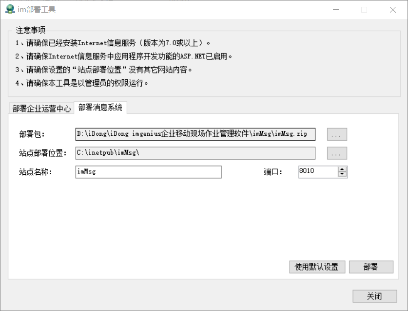

**消息系统部署目的**：

Web端，移动终端，短信，邮件有一个消息提醒的作用。
同时，在SMC系统配置中，要填好对应的项

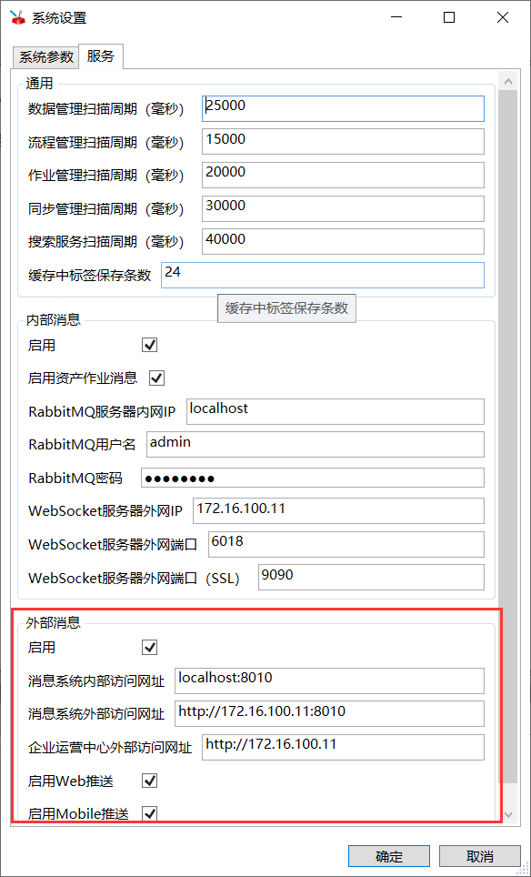

* 启用： 只有启用了消息系统才会工作。
* 端口号：8010可以更改
* 企业运营中心外部访问网址：按照服务器地址做配置
* 消息系统外部访问地址：按照服务器地址做配置

**能正常访问消息系统外部访问地址**，如下图，说明按照正常

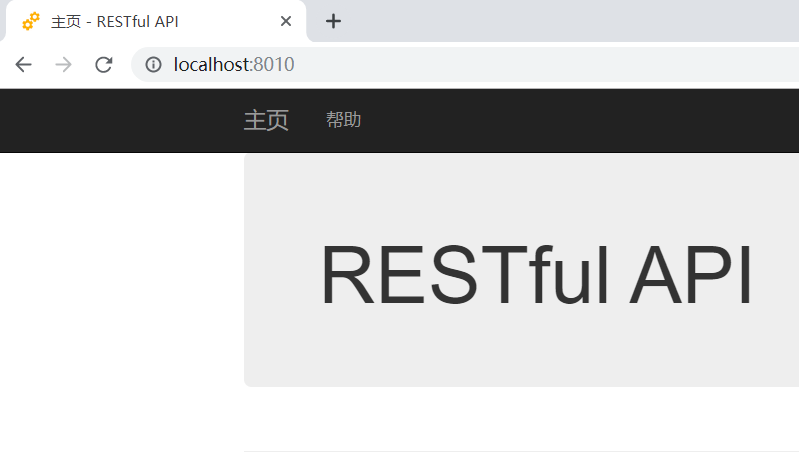

## 1.10 卸载或修改

* 在已经下载的imgenius 安装盘中点击运行Setup.exe，可以对已有安装组件进行修复和删除。

* 选择修复或删除，点击完成。 

* imgenius软件安装指南将根据选择进行修复或者删除。

* 可以点击取消，实现操作回滚。删除完成后，点击关闭，退出安装向导。

## 1.11 安装im移动工作站

im移动工作站是imgenius企业移动现场作业管理系统应用在手持终端设备供用户进行作业活动的软件。如图：

安装包中有三个apk文件，分别为**通用版，眼镜远程指导版，钛准定位版**，根据需要拷贝到安卓手机上安装，直接点击下一步允许安装即可。

